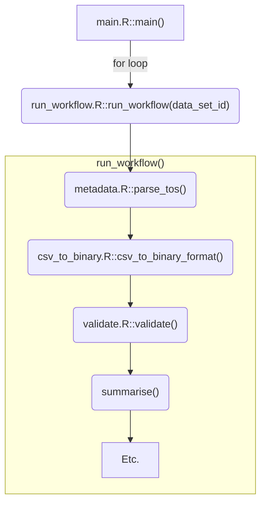

# R code

This directory contains the [R code](https://r-pkgs.org/code.html) for this package.

# Code structure

The entry-point to the workflow is the `main()` function in [main.R](./main.R). This iterates over the data sets, running `run_workflow()` for each one.

