# CUREd

An R package for working with CUREd data. This package handles the ingress of data and linking between the different data sources.

# Workflow

The following diagram is a representation of the current workflow that was used in the original CUREd data linkage and
validation. Each sub-graph represents a particular data source and for each source there are a number of scripts.

**NB** Unique row identifiers (`urid`) are a combination of the data source, the processing time and are padded with `0`.

```mermaid
%%{init: {'theme': 'base',
          {"flowchart": {"htmllabels": false}},
          { "logLevel": 2 }
         }
}%%
flowchart TD

subgraph AE
direction
A1["`**ae-extract** :
     On a per trust basis :
     Combines data files
     Tidies filenames
     Adds Trust Code
     Creates Unique Row identifiers
     Saves to rds file`"] --> A2["`**ae-transform** :
                                   On a per-trust basis :
                                   Converts dates (dob, arrival_date) to ISO8601 using fn_date_to_ISOdate()
                                   Convets times to AE format (HHMM) using fn_time_to_AEtime()
                                   Tansforms data using fn_TransformAE()
                                   Adds diag_scheme variable
                                   Calls fn_LoadAE from ae-load
                                   **NB** Has some custom code for specific trusts`"]
A2 --> A3["`**ae-partition** :
            fn_PartitionAE function defined...
            Combines sensitive and non-sensitive fields
            Loads files from data/sensitive/ae_preload/
            Removes blank values in data using fn_removeBlanks
            Adds missing fields if not present
            Saves a copy of non-sensitive data to data/nonsensitive/ae/

            Process all files under data/sensitive/ae_preload`"]
A3 --> A4["`**ae-save-reference** :
           Loads all sheets from data-raw/reference data/AE Reference Tables.xlsx
           Saves as R file in data/reference/ae_reference_data.rds`"]
A4 --> A5["`**ae-load** :
            fn_LoadAE function defined...
            Processes all files in data/sensitive/ae_to_db/
            Creates a table for each file in PostgreSQL database
            Will optionally replace existing tables`"]
A5 --> A6["`**ae evaluate null data and validation** :
            Loads data/evaluation/trustwise/ae-null-data-evaluation-* and
            data/evaulation/trustwise/ae-validation-evaulation-*
            Plots :
            Attendances with missing data for procodet_cat, month, attendances
            Linkage variables that are missing in date range 2011-04-01 to 2017-04-01
            Admin variables (diag_01, opertn_01, opdate_01, operstat) that are missing in date range 2011-04-01 to 2017-04-01`"]
end

subgraph APC
direction
B1["`**apc-db-process** : `"] --> B2["`**apc-extract** : `"]
B2 --> B3["`**apc-load** :
          `"]
B3 --> B4["`**apc-partition** :
          `"]
B4 --> B5["`**apc-save-reference** :
          `"]
B5 --> B6["`**transform** :
          `"]
B6 --> B7["`**apc-evaluate-validate** :
          `"]
B8["`**apc-sql fns** :
          `"]
end

subgraph AMB
direction
C1["`**amb-db-process** :
          `"] --> C2["`**amb-extract** :
                      `"]
C2 --> C3["`**amb-load** :
          `"]
C3 --> C4["`**amb-partition** :
          `"]
C4 --> C5["`**amb-save-reference data** :
          `"]
C5 --> C6["`**amb-transform** :
          `"]
end

subgraph NHS111
direction
D1["`**nhs111-db-process** :
          `"] --> D2["`**nhs111-extract** :
                      `"]
D2 --> D3["`**nhs111-load** :
          `"]
D3 --> D4["`**nhs111-partition** :
          `"]
D4 --> D5["`**nhs111-save-reference** :
          `"]
D5 --> D6["`**nhs111-evaluate-validate** :
          `"]
end

subgraph SHSC
direction
E1["`**shsc-db-process** :
          `"] --> E2["`**shsc-extract-transform** :
                      `"]
E2 --> E3["`**shsc-load** :
          `"]
E3 --> E4["`**shsc-save-reference** :
          `"]
E4 --> E5["`**shsc evaluate null data and validation** :
          `"]
end

subgraph St Lukes
direction
F1["`**shsc-db-process** :
             `"] --> F2["`**shsc-extract-transform** :
                         `"]
F2 --> F3["`**shsc-load** :
           `"]
F3 --> F4["`**shsc-save-reference** :
           `"]
end

subgraph Miscellaneous
direction
extracting_identifiers_cured_plus
postprocess_addresses
end

subgraph cleaning_fns_etl
direction
fn_date_to_ISOdate
fn_time_to_ISOdate
fn_datetime_to_ISOdate
fn_time_toAEtime
fn_removeBlanks
fn_splitForenamesSurnames
fn_cleanNames
fn_cleanPostcode
fn_validateCodes
fn_validateDates
fn_validateDatetimes
fn_validateAETimes
fn_validateDigits
fn_validateNumeric
fn_validateProcodet
fn_validateSitetret
fn_validateGpprac
fn_validateReferorg
fn_validateICD10Diagnosis
fn_validateOPCr0ps
fn_validateAEDiagnoses
fn_validateAEInvestigations
fn_validateAETreatments
fn_calcAge
end
```

## Script Sets

Each set of scripts pertain to a particular data source.

### NHS111

### AE

### `db-process`

### `extract`

Uses `r/cleaning_fns_etl.r`

| Data Files | Description |
|------------|-------------|
| `AE_Data_part1.csv`           |             |
| `AE_Data_part2.csv`           |             |

### `load`

### `partition`

### `save-reference`

### APC

### AMB

### SHSC

### St Lukes

### Miscellaneous

#### `clenaing_fns_etl.r`

Functions for cleaning data.

| Function                      | Description                                                                                 |
|-------------------------------|---------------------------------------------------------------------------------------------|
| `fn_date_to_ISOdate`          | Standardise date to [ISO8601](https://www.iso.org/iso-8601-date-and-time-format.html).      |
| `fn_time_to_ISOdate`          | Standardise time to [ISO8601](https://www.iso.org/iso-8601-date-and-time-format.html) to `HH:MM:SS`.      |
| `fn_datetime_to_ISOdate`      | Standardise date-time to [ISO8601](https://www.iso.org/iso-8601-date-and-time-format.html). |
| `fn_time_toAEtime`            | Converts to `HHMM`                                                                                            |
| `fn_removeBlanks`             |                                                                                             |
| `fn_splitForenamesSurnames`   |                                                                                             |
| `fn_cleanNames`               |                                                                                             |
| `fn_cleanPostcode`            |                                                                                             |
| `fn_validateCodes`            |                                                                                             |
| `fn_validateDates`            |                                                                                             |
| `fn_validateDatetimes`        |                                                                                             |
| `fn_validateAETimes`          |                                                                                             |
| `fn_validateDigits`           |                                                                                             |
| `fn_validateNumeric`          |                                                                                             |
| `fn_validateProcodet`         |                                                                                             |
| `fn_validateSitetret`         |                                                                                             |
| `fn_validateGpprac`           |                                                                                             |
| `fn_validateReferorg`         |                                                                                             |
| `fn_validateICD10Diagnosis`   |                                                                                             |
| `fn_validateOPCr0ps`          |                                                                                             |
| `fn_validateAEDiagnoses`      |                                                                                             |
| `fn_validateAEInvestigations` |                                                                                             |
| `fn_validateAETreatments`     |                                                                                             |
| `fn_calcAge`                  |                                                                                             |

# Scripts

### `db-process`

### `extract`

### `load`

### `partition`

### `save-reference`
